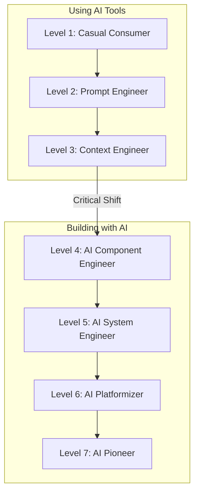

# AI Fluency Leveling: A 7-step leveling guide for assessment, upskilling, and hiring

**Source:** https://blog.alexewerlof.com/p/ai-fluency-leveling
**Author:** Alex Ewerlöf

---

## TLDR

A 7-level framework for measuring AI competency, from casual consumer to AI pioneer, with the critical transition at Level 4 where practitioners move from prompting to actual engineering with code.

---

## Key Takeaways

- AI competency spans 7 progressive levels: Casual Consumer → Prompt Engineer → Context Engineer → AI Component Engineer → AI System Engineer → AI Platformizer → AI Pioneer
- The crucial shift happens at Level 4, where you stop "prompting your way out of problems" and start using code to manage AI's probabilistic nature
- "Prompt engineering" is described as "a bag of tricks" rather than true engineering
- Impact grows exponentially across levels—AI pioneers may touch hundreds of millions of users vs. minimal individual impact at Level 1
- The framework serves self-learners, organizational leaders, hiring managers, and consumers filtering industry noise

---

## Summary

Alex Ewerlöf proposes a structured framework for assessing AI fluency across seven distinct levels. The progression starts with Level 1 (Casual Consumer) who uses AI tools occasionally, moves through Levels 2-3 (Prompt and Context Engineers) who become skilled at crafting prompts and understanding techniques like RAG and memory management, and then crosses a critical threshold at Level 4.

The transition to Level 4 (AI Component Engineer) marks the shift from "tinkering to engineering." At this level and beyond, practitioners use code to wrangle AI's inherent unpredictability rather than relying solely on prompt crafting. Levels 5-7 progress through building complete AI systems, creating platforms that enable others, and finally pioneering new research and techniques.

The framework addresses practical needs across different stakeholders: self-learners can chart intentional growth paths, organizational leaders can identify capability gaps, and hiring managers can better assess what level of AI competency a role actually requires. Ewerlöf emphasizes that impact grows exponentially—while a casual user has minimal individual impact, an AI pioneer may influence hundreds of millions of users. He positions the framework as "directional and recursive" rather than prescriptive, meant to evolve alongside the rapidly changing AI landscape.

---

## Diagram

### Diagram Explanation

This flowchart shows the 7-level AI fluency progression, grouped into two phases: "Using AI Tools" (Levels 1-3) and "Building with AI" (Levels 4-7). The critical transition between Level 3 and Level 4 marks the shift from prompting to engineering with code.
