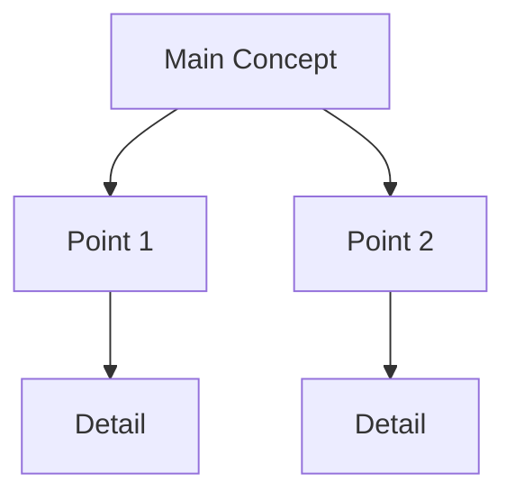
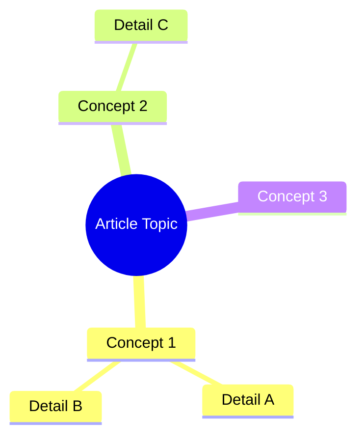

# Process Article Skill

This skill fetches an article, generates a summary using `/summarize-article`, and creates a Mermaid diagram visualizing the article's key concepts or flow.

## Usage Examples

- `/process-article https://example.com/article` - Summarize and create a diagram for the article

## Implementation Instructions

### Step 1: Parse Arguments

The user must provide a URL as an argument:
- If no URL is provided, ask the user to provide one and stop

### Step 2: Generate the Summary

Use the `/summarize-article` skill with the provided URL to get the article summary:
- This will produce the TLDR, Key Takeaways, and Summary sections

**CRITICAL: After the summary is generated, you MUST continue with Steps 3-7 below. Do NOT stop after this step. The summary is just the first part of this skill - you still need to generate and validate the diagram, save everything to a file, and commit/push to git.**

### Step 3: Analyze for Diagram Type

Based on the article content, determine the most appropriate Mermaid diagram type:

| Article Type | Diagram Type |
|--------------|--------------|
| Process/How-to | `flowchart TD` (top-down flow) |
| Timeline/History | `timeline` |
| Comparison | `flowchart LR` with parallel branches |
| Hierarchy/Organization | `flowchart TD` with tree structure |
| Cause & Effect | `flowchart LR` (left-right flow) |
| Concept relationships | `mindmap` |
| Sequential steps | `flowchart TD` with numbered nodes |

### Step 4: Generate the Mermaid Diagram

Create a Mermaid diagram that captures:
- The main concepts or steps from the article
- Relationships between ideas
- The logical flow or structure
- Key takeaways as leaf nodes when appropriate

### Step 5: Validate the Mermaid Diagram

Use the local validation script to validate the generated diagram:

1. Check if dependencies are installed:
```bash
test -d ~/.claude/skills/process-article/node_modules && echo "ready" || echo "missing"
```

If "missing", inform the user:
> "The mermaid validation dependencies are not installed. Please run:
> `cd ~/.claude/skills/process-article && npm install`
> Then try the command again."

Stop execution if dependencies are missing.

2. Write the diagram to a temp file using the Write tool:
   - File: `/tmp/diagram.mmd`
   - Content: the mermaid diagram code (without the ```mermaid fences)

4. Run the validation script:
```bash
node ~/.claude/skills/process-article/validate-mermaid.mjs /tmp/diagram.mmd
```

5. Parse the JSON output:
   - `{"valid": true}` → Diagram is valid, proceed to output
   - `{"valid": false, "error": "...", "line": N}` → Syntax error, fix and retry

6. If validation fails:
   - Read the error message from the JSON output
   - Fix the syntax issue in the diagram
   - Re-validate until it passes
   - Maximum 3 retry attempts

7. Clean up: `rm -f /tmp/diagram.mmd`

### Step 6: Save to File

After successful validation, save the complete output to a markdown file:

1. Generate the filename using:
   - The article's publication date in `YYYY-MM-DD` format (extracted from the summary)
   - The author's last name (lowercase)
   - The article title converted to a slug (lowercase, spaces to hyphens, remove special characters)
   - Format: `YYYY-MM-DD-author-article-title-slug.md`
   - Example: `2025-10-02-larsson-structure-for-ai-engineering.md`

2. Create the directory structure:
   - Extract the year and month from the publication date
   - Month should be lowercase full name (january, february, etc.)
   - Format: `YYYY/month-name/`
   - Example: `2025/october/`

3. Get the user's working directory (where Claude was invoked):
```bash
pwd
```

4. Create the directory if it doesn't exist:
```bash
mkdir -p [working-dir]/to-read/YYYY/month-name
```

5. Combine all content into the file:
   - The summary from `/summarize-article` (title, source, author, published date, TLDR, takeaways, summary)
   - The diagram section:

```markdown
---

## Diagram

```mermaid
[Validated Mermaid diagram code]
```

### Diagram Explanation

[1-2 sentences explaining what the diagram represents and how to read it]
```

6. Write the file to: `[working-dir]/to-read/YYYY/month-name/YYYY-MM-DD-author-article-title.md`

7. Inform the user: "Saved to: [full path]"

### Step 7: Commit and Push

After saving the file, commit it to git and push to the remote repository:

1. Stage the new file:
```bash
git add [full-path-to-saved-file]
```

2. Commit with a descriptive message using the article title:
```bash
git commit -m "Add article: [Article Title]"
```

3. Push to the remote repository:
```bash
git push origin main
```

4. Inform the user: "Committed and pushed to origin/main"

## Mermaid Syntax Guidelines

### Flowchart Example


### Mindmap Example


### Timeline Example
```mermaid
timeline
    title Article Timeline
    Section 1 : Event A
    Section 2 : Event B
    Section 3 : Event C
```

## Important Notes

- **CRITICAL**: After `/summarize-article` completes, CONTINUE with Steps 3-7. Do not stop execution after the summary.
- Keep diagrams readable: aim for 5-12 nodes maximum
- Use clear, concise labels (2-4 words per node)
- Choose the diagram type that best represents the article's structure
- Ensure the diagram adds value beyond the text summary
- ALWAYS validate the Mermaid diagram using the local validation script before outputting
- If validation fails, fix the syntax and retry (max 3 attempts)
- For complex articles, focus on the main flow rather than every detail
- Always include a brief explanation of the diagram
- Clean up temp files after validation: `rm -f /tmp/diagram.mmd`
- Only use Bash for running the validation script and creating directories, nothing else
- ALWAYS save the output to a file with format: `YYYY-MM-DD-author-article-title-slug.md`
- Files are stored in a year/month directory structure: `to-read/YYYY/month-name/filename.md`
- The file MUST be saved to the user's working directory (use `pwd` to get it), NOT the skill directory
