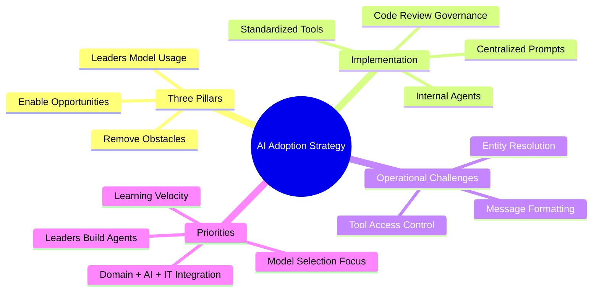

# Facilitating AI adoption at Imprint

**Source:** https://lethain.com/company-ai-adoption/
**Author:** Will Larson
**Published:** 2025-12-07

---

## TLDR

Effective AI adoption requires hands-on leadership engagement, focuses on removing barriers rather than mandating usage, and demands careful attention to operational details (entity resolution, message formatting, tool governance) alongside strategic vision.

---

## Key Takeaways

- Three pillars of AI adoption: remove obstacles, enable opportunities across functions, and have leaders model usage
- Avoid "optics-driven" adoption that prioritizes appearance over genuine productivity
- Centralize prompts in a discoverable database and standardize on specific AI tools
- Build internal agents with proper code review and configuration management
- Focus on workflows with clear pain points or impact potential
- Track usage metrics to understand power adopters and non-adopters, not just numbers

---

## Summary

Will Larson shares working notes on implementing LLM and AI agent adoption at Imprint. He outlines a strategic framework with three core pillars: removing adoption obstacles, enabling opportunities across all functions, and ensuring senior leadership actively models AI usage. He explicitly opposes "optics-driven" adoption that prioritizes appearing innovative over achieving genuine productivity gains.

On the implementation side, Larson describes centralizing prompts in a discoverable Notion database, standardizing on OpenAI for general use with Claude via AWS Bedrock for engineering, and building internal agents through a stateless Lambda function (approximately 3,000 lines of Python). Agent configurations are stored in Git repositories with code review requirements for governance.

The article highlights critical operational challenges that often get overlooked: entity resolution (translating human-readable references like "@Will Larson" to proper Slack identifiers), message formatting compliance across different platforms (Slack's mrkdwn, Jira's ADF format), and tool access governance that balances capability with safety.

Larson concludes with four priorities: emphasizing learning velocity, requiring leaders to build working agents themselves, integrating domain expertise with AI knowledge and IT practicalities, and maintaining focus on model selection. Successful deployments mentioned include customer support routing, infrastructure requests, ticket triaging, and compliance assistance.

---

## Diagram

### Diagram Explanation

This mindmap shows the four main areas of AI adoption strategy: the three foundational pillars, implementation components, operational challenges to address, and ongoing priorities. Each branch details the specific elements within that category.
