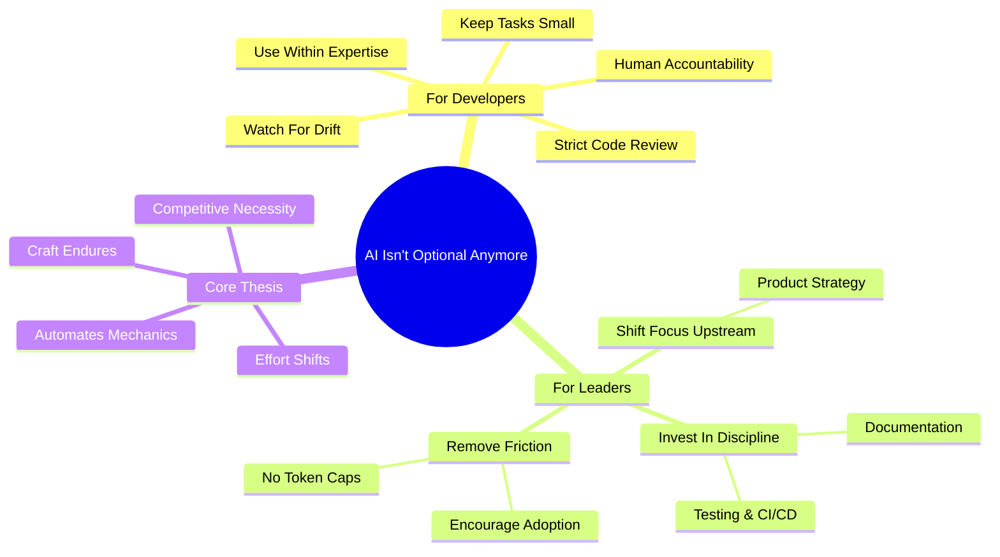

# AI isn't optional anymore

**Source:** https://nlopes.dev/writing/ai-isnt-optional-anymore
**Author:** Nuno Lopes
**Published:** 2026-02-04

---

## TLDR

AI adoption in professional software development is no longer discretionary — organizations that restrict or ignore it will fall behind competitively. The real debate should focus on how to use AI effectively and responsibly, not whether to use it at all.

---

## Key Takeaways

- Individual developers can choose not to use AI, but organizations that restrict it are falling behind competitively
- Only use AI for code within your existing expertise, and keep tasks small enough to fully review
- Apply stricter code review standards to AI-generated code than to peer-written code — human accountability remains essential
- Leaders should invest in engineering discipline (testing, CI/CD, documentation) and shift focus upstream to product strategy as coding becomes cheaper
- AI automates mechanical implementation work, not strategic thinking — the craft of engineering endures, only the effort allocation shifts

---

## Summary

Nuno Lopes argues that AI has crossed a threshold where it is no longer a nice-to-have curiosity but a fundamental productivity lever in professional software development. Drawing from his experience at incident.io, he contends that while individual developers can opt out, organizations that fail to embrace AI tools are making a competitively costly decision. The productivity gains are measurable and substantial when AI is integrated properly into workflows.

The article lays out practical best practices for effective AI usage: only use AI to generate code in areas you already understand, keep tasks small enough to fully review, and apply even stricter review standards to AI-generated code than to peer-written code. Lopes warns developers to watch for unintended changes and repetitive failed attempts, emphasizing that human accountability for the output must remain absolute regardless of the tool used.

For engineering leaders, the guidance centers on enabling rather than mandating adoption. This means investing in engineering discipline — robust testing, CI/CD pipelines, and documentation — while shifting organizational focus upstream to product strategy as the cost of writing code decreases. Leaders should remove friction by avoiding token caps or restrictive mandates, and should communicate explicitly that AI tool usage is encouraged.

Lopes concludes by drawing parallels to previous industry shifts, noting that skepticism about AI is valid but that building proficiency with these tools is now a necessary part of the modern software engineer's skill set. The craft of engineering endures; what changes is where effort is allocated.

---

## Diagram

### Diagram Explanation

This mindmap organizes the article's key arguments into three branches: practical guidance for developers, strategic advice for leaders, and the core thesis. Read from the center outward to understand how the overarching argument (AI is now a competitive necessity) breaks down into actionable recommendations for both individual contributors and engineering leadership.
