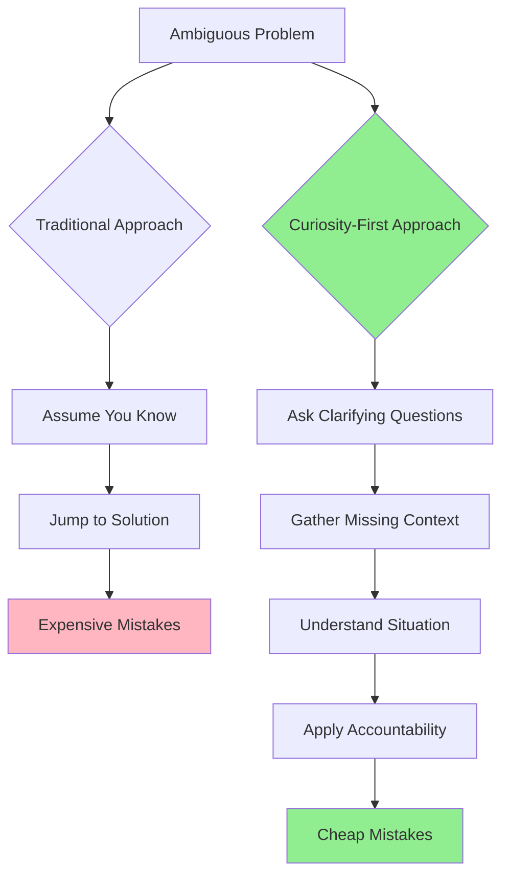

# Curiosity is the first-step in problem solving

**Source:** https://lethain.com/curiosity-first-step-problem-solving/
**Author:** Will Larson
**Published:** 2026-01-25

---

## TLDR

When facing ambiguous problems, focus on making mistakes cheap rather than avoiding them entirely—and the most effective way to do this is by demonstrating curiosity (seeking to understand missing information) before jumping into problem-solving mode.

---

## Key Takeaways

- Many high-stakes decisions are inherently probabilistic and cannot guarantee correct outcomes
- Shift focus from avoiding mistakes to managing their consequences
- Curiosity reduces costs by uncovering context before applying accountability
- Ask clarifying questions rather than assuming someone is wrong
- Curiosity precedes accountability—it doesn't replace it
- Embed curiosity into organizational processes through automation and documentation

---

## Summary

Will Larson argues that many professional challenges—hiring decisions, pandemic-driven pivots, regulatory compliance—are deeply ambiguous and cannot be solved perfectly with available information. Rather than striving to avoid all mistakes, leaders should focus on making their inevitable errors inexpensive.

The key technique for reducing the cost of errors is demonstrating curiosity before problem-solving. This means leaving space for missing information and gathering context before jumping to conclusions. Larson illustrates this through scenarios showing poor, good, and best approaches: the poor approach jumps straight to solving; the good approach gathers some context; the best approach leads with genuine curiosity about what might be missing.

Importantly, curiosity is not about avoiding accountability or delaying action indefinitely. It precedes rather than replaces holding people responsible. Larson also suggests embedding curiosity into organizational processes through automation, documentation, and bots that prompt teams to consider what they might be missing.

The author presents curiosity as a core organizational value and provides practical scenarios demonstrating how to apply this principle in leadership contexts.

---

## Diagram

### Diagram Explanation

This flowchart contrasts two approaches to ambiguous problems: the traditional approach (left path) assumes knowledge and jumps to solutions, leading to expensive mistakes; the curiosity-first approach (right path, highlighted in green) gathers context through questions before applying accountability, resulting in cheaper mistakes.
