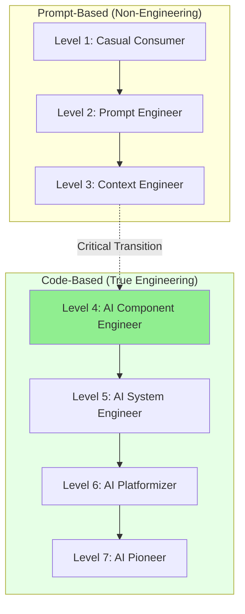

# AI Fluency Leveling

**Source:** https://blog.alexewerlof.com/p/ai-fluency-leveling
**Author:** Alex Ewerlöf
**Published:** 2026-01-30

---

## TLDR

A seven-level framework for assessing AI competency among knowledge workers, from casual consumer (Level 1) to AI pioneer (Level 7), with the critical transition at Level 4 where practitioners shift from prompt engineering to writing production code that handles AI's probabilistic nature.

---

## Key Takeaways

- AI fluency can be measured across seven distinct levels, each with specific skills and responsibilities
- The critical transition occurs at Level 4, moving from "prompt engineering" to actual engineering with code
- "Prompt engineer" is considered a misnomer—it's more of a "bag of tricks" than true engineering
- The framework helps individuals plan learning paths, leaders make investment decisions, and hiring managers evaluate candidates
- Level 1 practitioners risk obsolescence in knowledge work without developing compensating skills

---

## Summary

Alex Ewerlöf presents a seven-level framework for assessing AI fluency among knowledge workers. The levels progress from casual consumer (Level 1) through prompt "engineer" (Level 2), context "engineer" (Level 3), AI component engineer (Level 4), AI system engineer (Level 5), AI platformizer (Level 6), to AI pioneer (Level 7). Each level represents distinct competencies and responsibilities in working with AI systems.

A central argument is that the critical transition occurs at Level 4, where practitioners move beyond "prompt engineering" (which Ewerlöf dismisses as merely a "bag of tricks") to writing actual production code that handles AI's probabilistic nature with proper mitigation patterns and evaluation frameworks. Levels 2 and 3, while involving daily AI use and techniques like RAG and context management, don't constitute true engineering work.

The framework serves multiple purposes: guiding individual learning paths, enabling leadership to assess and invest appropriately, resolving friction in product teams about AI capabilities, helping consumers filter AI news, and informing hiring decisions. Ewerlöf notes it took him approximately one year to reach Level 4, emphasizing that progression requires deliberate effort and technical skill development.

---

## Diagram

### Diagram Explanation

This flowchart shows the seven AI fluency levels as a progression, with the critical transition between Level 3 and Level 4 (shown as a dashed line) marking the shift from prompt-based work to true code-based engineering. The two subgroups distinguish non-engineering levels from engineering levels.
