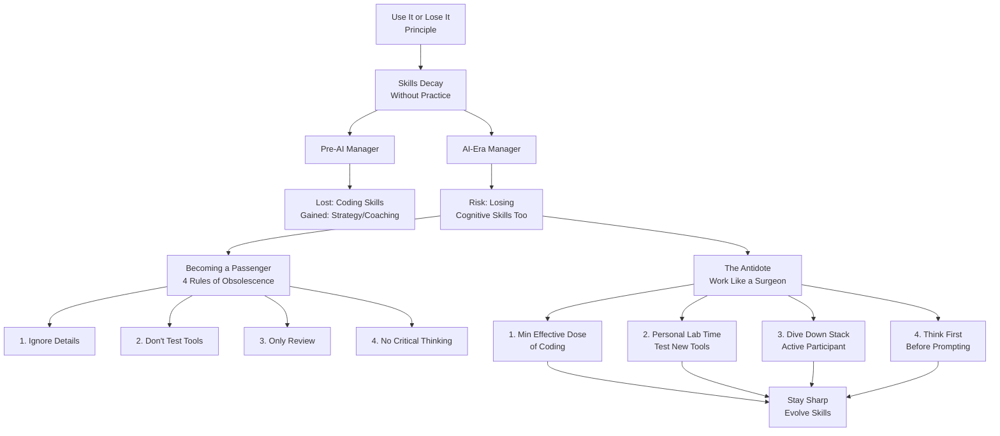

# Use it or lose it

**Source:** https://theengineeringmanager.substack.com/p/use-it-or-lose-it
**Author:** The Engineering Manager
**Published:** 2025-12

---

## TLDR

The "use it or lose it" mental model from Charlie Munger warns that skills decay without regular practice, and as managers increasingly offload cognitive work to AI, there's a risk of losing critical thinking abilities—the solution is to use AI intentionally as a surgical assistant while maintaining hands-on practice of core skills.

---

## Key Takeaways

- Skills decay rapidly without regular use—coding abilities, spatial memory, and cognitive depth all diminish when we stop practicing them
- AI creates a "competence pacifier" risk where managers become passengers in their own organizations by offloading all thinking to AI
- To stay sharp: maintain a "minimum effective dose" of coding, actively test new AI tools personally, dive deeper than expected into technical details, and think first before prompting AI
- Work like a surgeon: you make the key decisions and actions while AI handles the grunt work as your assistant
- Doing things that don't scale as a manager is how you build respect, stay close to details, and preserve cognitive abilities

---

## Summary

The article explores Charlie Munger's "use it or lose it" mental model through the lens of management in the AI age. Munger reflected that in his 80s, he only remembered what he'd used daily since school—the basics of mathematics for reading balance sheets, not the advanced calculus he once knew. This principle applies universally: Polish pianist Paderewski noted that missing one day's practice meant he noticed, two days meant critics noticed, three days meant the audience noticed.

For managers, skill decay has long been a concern, particularly losing coding abilities after moving into management roles. Pre-AI, this trade-off was acceptable because managers gained daily practice in other core skills like strategic thinking, planning, and coaching. But as managers increasingly offload these cognitive functions to AI (for strategic thinking, decision-making, and planning), there's a risk of losing these fundamental abilities too. Studies show this pattern: the 2011 "Google Effect" demonstrated brains optimize for where to find information rather than the information itself, 2021 research found offloading behavior correlates with decreased memory accuracy, and a 2025 MIT Media Lab study showed ChatGPT users had increased efficiency but weaker neural connectivity and cognitive depth.

The article uses inversion (from the previous month's mental model) to identify four rules for guaranteeing obsolescence as a leader: stop being close to technical details, don't personally try new AI tools, become purely a reviewer rather than participant, and never engage in first-principles thinking. Following these rules means actively choosing to become a passenger with no cognitive challenge left in the role.

The antidote involves four practices: First, find your minimum effective dose of coding through internal tools, prototypes, or pair programming—activities that keep you close to the workflow without blocking production. Second, personally test new AI tools weekly in "lab time" rather than outsourcing your understanding to others; compare tools like Antigravity versus Cursor yourself. Third, become an active participant by "diving down the stack"—going one or two levels deeper than your team expects, whether technically or logically, which builds both your confidence and their respect. Fourth, adopt a "thinking first" protocol: delegate only truly menial tasks completely to AI, but for substantive work, always take a first pass using your own cognition before using AI to critique and expand.

The surgeon metaphor captures this approach: you make key decisions and actions while AI serves as your team of assistants handling grunt work. This prevents cognitive offloading while preserving automation benefits. The path forward isn't rejecting AI but using it with intent—doing things that don't scale, engaging critical thinking before prompting, and diving into details. By doing so, managers won't just preserve skills but evolve them, becoming broader, deeper, and more effective leaders in a transformed management landscape.

---

## Diagram

### Diagram Explanation

This flowchart visualizes the evolution from the "use it or lose it" principle through pre-AI and AI-era management challenges, contrasting the four rules of obsolescence (becoming a passenger) with the four-part antidote (working like a surgeon) that leads to staying sharp and evolving skills.
