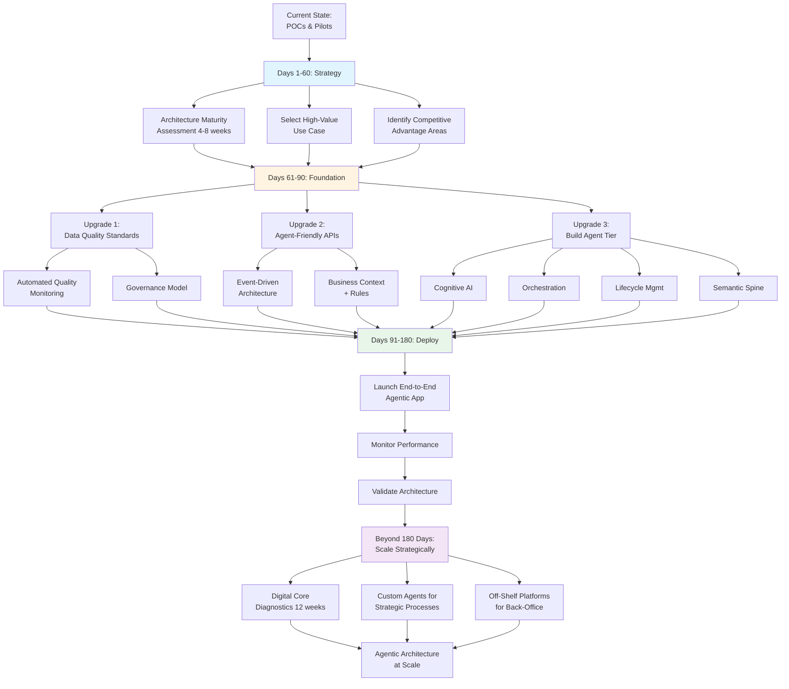

# How to get your enterprise architecture ready for agentic AI

**Source:** https://www.cio.com/article/4119297/how-to-get-your-enterprise-architecture-ready-for-agentic-ai.html  
**Author:** Not specified (CIO.com)  
**Published:** 2026 (exact date not provided)

---

## TLDR

Agentic AI requires three critical infrastructure upgrades—data quality standards, agent-friendly APIs, and a new agent tier—that organizations can implement in 180 days through rapid iteration rather than extended planning.

---

## Key Takeaways

- Agentic AI takes autonomous actions across systems without human intervention, unlike ChatGPT-style assistants that only recommend
- 67% of executives say AI will substantially transform their organization's core; 31% are deploying agents across multiple functions
- Three critical upgrades: robust data quality standards, agent-friendly integration architecture, and a new agent tier (cognitive AI + orchestration + lifecycle management + semantic spine)
- Aggressive timeline: 60 days for strategy, 90 days to build agent tier, 180 days to deliver first end-to-end agentic application
- Build the agent tier as an enhancement on existing infrastructure, not a replacement
- Start with one high-value customer-facing or revenue-generating process to capture C-suite attention

---

## Summary

Accenture's article addresses the infrastructure gap between current enterprise architectures and the requirements for agentic AI systems. Unlike generative AI assistants that analyze and recommend, agentic AI autonomously executes multiple actions across organizational silos to achieve business goals. According to Accenture's Pulse of Change survey of 3,650 executives, while 67% anticipate substantial organizational transformation, most companies remain in POC or limited pilot stages—only 15% are working on agentic POCs, with 31% running function-specific pilots and 31% deploying across multiple functions.

**Three Critical Upgrades**

**Data Quality Standards**: When autonomous agents make decisions based on flawed data, errors propagate through systems before detection. Organizations must refresh data quality standards in critical domains (customer, product, financial data), implement automated quality monitoring that flags anomalies before affecting agent operations, and establish data quality governance models tested in one domain before scaling.

**Agent-Friendly Integration Architecture**: Traditional APIs move data but lack the business context agents need to understand and orchestrate workflows. Companies should focus integration investments on frequently orchestrated systems (customer operations, financial workflows, HR, IT infrastructure, compliance), create event-driven architectures that reveal not just data but business context and rules, and deploy real-time data integration for time-critical value chains.

**Agent Tier**: Organizations need a new architectural layer consisting of four components: cognitive AI for reasoning, autonomous orchestration systems that trigger applications, agent lifecycle management for onboarding/updating/monitoring, and a semantic spine that helps agents interpret and reason across data silos. This tier enhances rather than replaces existing infrastructure.

**180-Day Implementation Timeline**

The article proposes an accelerated approach contrasting with typical 18-24 month enterprise architecture initiatives. Survey data shows 21% of organizations redesigning end-to-end processes with AI at the core, with 45% converging multiple processes using AI—justifying the urgency.

**Days 1-60 (Strategy)**: Run enterprise architecture maturity assessment (4-8 weeks) to identify scalability blockers. Evaluate customer-facing, revenue-generating processes feasible within 180 days. Assess where proprietary agent development creates competitive advantage.

**Days 61-90 (Foundation)**: Establish agent tier for selected use case. Upgrade data governance and API capabilities for required systems. Implement auditability, observability, and semantic spine for involved systems.

**Days 91-180 (Deploy)**: Launch first end-to-end agentic application. Monitor performance to identify where autonomous decision-making works well versus where human oversight remains necessary. Validate architectural choices and identify strengthening needs before scaling.

**Scaling Beyond 180 Days**

Post-implementation, conduct digital core diagnostics within 12 weeks to plan broader rollout. Build custom agents for strategic, rapidly-evolving unique processes. Deploy off-the-shelf platforms for standardized back-office functions. Map integration priorities and governance frameworks for expanded use cases.

The conclusion: Organizations establishing foundational agentic architecture within 180 days—even if imperfect—will capture value while competitors remain stuck in pilot mode. The gap is substantial, but rapid iteration beats extended planning.

---

## Diagram

### Diagram Explanation

This flowchart visualizes Accenture's 180-day roadmap for implementing agentic AI architecture. The diagram breaks down the three phases (Strategy, Foundation, Deploy) with their specific deliverables, showing how the three critical upgrades (data quality, agent-friendly APIs, agent tier) feed into deployment, ultimately leading to strategic scaling beyond the initial 180 days.
