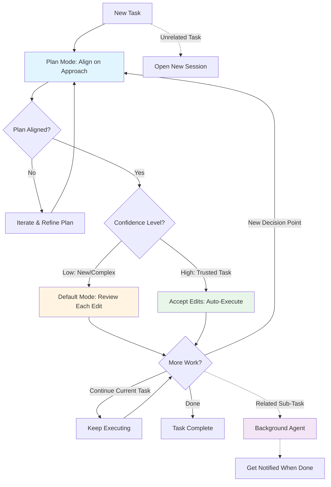

# Claude Code for Everything: How the Guy Who Built It Actually Uses It

**Source:** https://hannahstulberg.substack.com/p/claude-code-for-everything-how-the  
**Author:** Hannah Stulberg  
**Published:** 2026-02-01

---

## TLDR

Boris Cherny, creator of Claude Code at Anthropic, reveals his surprisingly vanilla workflow that starts with Plan mode, uses parallel sessions, and proves that mastering fundamentals beats fancy customizations for both coding and non-coding tasks.

---

## Key Takeaways

- Start every session in Plan mode to align on approach before execution - like reviewing a junior employee's proposal before they begin
- Run parallel sessions (5+) to avoid context-switching and keep each task focused
- Match your oversight level to confidence: Plan mode for new decisions, default mode for execution, accept edits for trusted tasks
- Use background agents for related tasks that need current context but shouldn't block your main work
- Work in an IDE with split editor (markdown left, preview right) for document-heavy workflows
- The setup for coding is the setup for everything - these workflow fundamentals apply to writing, research, planning, and any other task

---

## Summary

Hannah Stulberg's second article in her "Claude Code for Everything" series breaks down the workflow of Boris Cherny, Claude Code's creator at Anthropic. Released just as Anthropic launched Cowork (a research preview bringing agentic capabilities to non-coding work), the timing validates that "Claude Code for everything" isn't a workaround—it's the product direction.

**Core Workflow Fundamentals**

Boris's workflow centers on four principles that work for any task, not just coding:

**Plan Mode First**: Claude Code has three modes (Plan, Default, Accept edits), toggled with Shift+Tab. Boris starts almost every session in Plan mode, where Claude explores and proposes an approach without executing. You iterate on the plan—asking questions, pushing back, refining—until aligned. Only then do you switch to default (review each change) or accept edits (auto-execute trusted tasks). The key insight: match oversight to confidence, just like supervising a junior employee.

**Parallel Sessions**: Boris runs 5+ sessions simultaneously, each dedicated to one task. Every Claude Code instance is like a separate junior employee—give it one focused task rather than juggling multiple contexts. Open separate terminal instances in your IDE, each running its own session.

**Session Management**: Name sessions with `/rename` and resume them later with `/resume`. Without this, every new Claude Code instance starts with zero memory. Stulberg recommends typing the session name directly into your working document since the search feature can be buggy.

**Background Agents**: Delegate related sub-tasks to independent Claude instances that run in parallel. The sweet spot: tasks needing current context but that shouldn't block your main work. Tell Claude to "run this in the background," keep working, and get notified when complete. Check running tasks with `/tasks`.

Boris uses Opus 4.5 with thinking for everything—bigger and slower than Sonnet, but requires less steering and produces better first drafts, making it faster overall.

**Workspace Setup for Documents**

When working with documents rather than code, four setup tips matter:

**Split Editor**: Keep markdown on the left, preview on the right (synced scrolling). Read the formatted preview while making quick edits in raw markdown—best of both worlds.

**Table of Contents**: For long markdown files, ask Claude to generate a clickable TOC at the top. Transforms walls of text into navigable documents.

**IDE Over Terminal**: Run Claude Code in Cursor or VS Code, not a standalone terminal. Everything in one window: file structure, documents, terminals, markdown preview. Avoid third-party wrappers that sit between you and Claude Code—they control your experience and lag behind Anthropic's updates.

**PDF Extension**: Install vscode-pdf in Cursor so you can view PDFs directly without switching apps—essential for research papers, contracts, reference documents.

**What's Coming**

The article previews advanced customization features (covered in future articles):
- Slash commands: Save repeated workflows as single-command shortcuts
- Subagents: Automate review/polish steps that run on most tasks  
- MCP integrations: Connect Claude directly to Notion, Slack, etc.

But Stulberg emphasizes fundamentals first. The biggest unlock from Boris's workflow: the setup for coding *is* the setup for everything. Plan mode, parallel sessions, matching oversight to confidence—these are productivity fundamentals that work whether you're writing code, articles, or research reports. Master the basics before jumping to fancy features.

---

## Diagram

### Diagram Explanation

This flowchart visualizes Boris Cherny's core Claude Code workflow as a decision tree. Start in Plan mode, iterate until aligned, then choose your oversight level (Default or Accept edits) based on confidence. The diagram shows how you dynamically shift between modes as work progresses, with dotted lines representing parallel sessions and background agents for multitasking.
