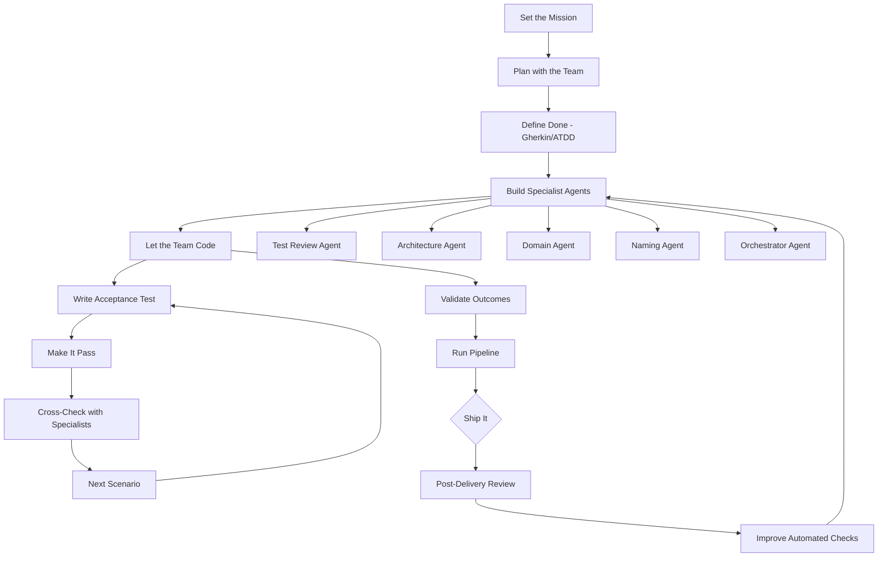

# AI Development Playbook - Leading an Agentic Development Team

**Source:** https://bdfinst.github.io/ai-patterns/ai-development-playbook/
**Author:** Bryan Finster
**Published:** 2026-02-09

---

## TLDR

Leading AI coding agents effectively requires the same leadership and engineering discipline as leading human teams: set clear missions, define acceptance criteria before coding, build specialist review agents, and validate outcomes rather than activity.

---

## Key Takeaways

- Treat AI agents like a development team: give them business context and clear goals, not step-by-step instructions on HOW to code
- Use Acceptance Test-Driven Development (ATDD) with Gherkin scenarios instead of classic TDD—agents need scenario-level scope to make architectural decisions
- Build focused specialist agents (test review, architecture, domain, naming) coordinated by an orchestrator, like Unix pipelines: small sharp tools beat one monolithic tool
- Stop manually reviewing AI-generated code once you have automated quality processes—manual review becomes a bottleneck that increases batch size and risk
- AI is a high-pass filter for leadership and engineering discipline: if you have CD/TDD discipline, agents give dramatic improvement; if you don't, you'll generate garbage faster
- Post-delivery reviews by senior engineers are better than pre-merge gates—they enable continuous improvement without disrupting flow

---

## Summary

Bryan Finster shares his journey from AI skeptic to advocate, describing how he initially dismissed AI coding tools after seeing ChatGPT generate fictional libraries, but changed his mind after seeing rapid model improvements and watching respected DevOps leaders like Patrick Dubois and John Willis experiment with AI successfully.

The core insight is that leading AI agents mirrors leading human development teams. The same dysfunctions that plague undisciplined human teams—vague requirements, skipping tests, confusing activity with progress—produce identical failures with AI agents. The fix is also identical: ensure the team has clear goals, business context, and quality processes.

Finster outlines a concrete workflow: start with a 3-5 sentence mission describing what to build and why (not how), have the agent generate a plan and iterate on it, then define "done" using Gherkin acceptance tests before any coding begins. He emphasizes ATDD over classic TDD for agents because scenario-level scope gives agents enough context to make good architectural decisions, whereas unit-level TDD micromanages them into producing disconnected code.

The team structure uses focused specialist agents—test review, architecture, domain patterns, naming—coordinated by an orchestrator agent. This mirrors the Unix philosophy of small, sharp tools composed together. Adversarial cross-checking between agents creates automated guardrails. Once this quality system is in place, Finster argues you should stop manually reviewing code entirely, as it becomes a bottleneck that increases batch size and slows feedback. Post-delivery reviews by senior engineers handle continuous improvement without gating flow.

The article concludes that the fundamental skill needed isn't prompt engineering or model selection—it's knowing how to ensure a development team has what it needs to deliver. AI amplifies existing engineering discipline exponentially.

---

## Diagram

### Diagram Explanation

This flowchart shows the agentic development workflow from mission setting through delivery. The main flow runs top-down through the seven steps. The specialist agents branch shows the team composition, while the inner loop illustrates the ATDD cycle of writing acceptance tests, making them pass, and cross-checking with specialists. Post-delivery reviews feed improvements back into the specialist agents, creating a continuous improvement loop.
