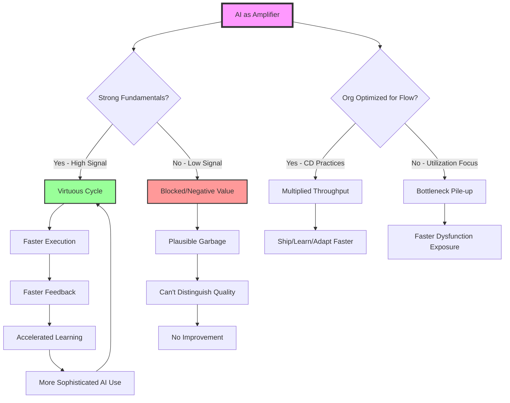

# AI is a High Pass Filter for Software Delivery

**Source:** https://bryanfinster.substack.com/p/ai-is-a-high-pass-filter-for-software
**Author:** Bryan Finster
**Published:** 2026-02-09 (saved date, publication date not available)

---

## TLDR

AI acts as a high-pass filter that amplifies existing engineering excellence while exposing dysfunction—developers and organizations with strong fundamentals see massive gains, while those without see minimal or negative returns.

---

## Key Takeaways

- AI multiplies the capabilities of developers who already have strong fundamentals (TDD, BDD, CD, design skills), creating a compounding learning loop
- For organizations, AI only delivers value if your software delivery system is optimized for flow; otherwise it just piles up inventory at existing bottlenecks faster
- Studies showing minimal AI productivity gains are measuring the wrong things (utilization metrics vs business outcomes) and averaging high and low performers together
- The gap between high and low performers is widening into a chasm—AI accelerates those with mature continuous delivery practices while leaving others behind
- To pass the filter: individuals must build fundamentals (testing, BDD, domain knowledge); organizations must engineer for flow (trunk-based dev, small batches, automated quality)

---

## Summary

The article uses the metaphor of a high-pass filter from signal processing to explain AI's impact on software delivery. Just as a high-pass filter allows high-frequency signals to pass while blocking low frequencies, AI amplifies the output of developers and organizations that already have strong "signal amplitude"—solid engineering fundamentals and practices.

For individual developers with strong skills in engineering, design, workflow, and leadership, AI creates a virtuous cycle: better execution leads to faster feedback, which leads to accelerated learning, which enables more sophisticated AI use. The author describes prototyping in hours instead of days, testing ideas in minutes instead of weeks, and having lower emotional investment in throwaway experiments. However, developers without these fundamentals simply get AI-generated "plausible-looking garbage" faster, unable to distinguish good from bad code.

The same dynamics apply organizationally, but more dramatically. Organizations designed for flow optimization (DevOps, continuous delivery) see AI multiply their value delivery throughput. But organizations optimized for resource utilization and feature factory models simply accumulate information inventory at bottlenecks faster. AI exposes organizational dysfunction much faster than continuous delivery ever did, without the soft landings.

The article addresses the counterargument from multiple studies showing minimal AI productivity gains. Finster argues these studies have fatal flaws: they measure vanity metrics (lines of code, completion speed) instead of business outcomes; they don't control for engineering maturity or organizational context; they average together high and low performers; and critically, they measure what happens when you add AI without changing workflows to leverage it. He compares this to every failed platform transformation—giving people new capabilities without changing how they work produces marginal results. The studies aren't measuring AI's failure; they're measuring organizational inability to leverage new platforms.

The prescription is clear: individuals must build fundamentals in testing, behavior-driven development, and domain knowledge. Organizations must engineer their software supply chain for flow through practices like trunk-based development, small batch sizes, automated quality gates, and operational responsibility. These aren't optional—they're prerequisites for AI to deliver value. Organizations already practicing continuous delivery properly are well-positioned; those that haven't will have their dysfunction illuminated like a supernova. The gap between high and low performers is widening now, not in some theoretical future, and the choice is to improve your signal or join the average.

---

## Diagram

### Diagram Explanation

This flowchart shows AI as a high-pass filter that creates divergent paths based on existing fundamentals. For individuals and organizations with strong signal (solid engineering practices and flow optimization), AI creates accelerating virtuous cycles. For those without, AI either delivers no value or actively exposes dysfunction.