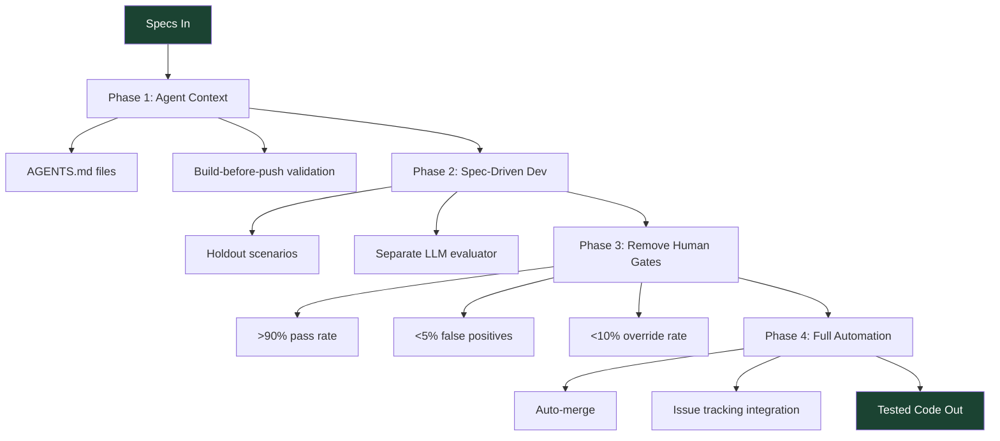

# The Dark Factory Pattern: Moving From AI-Assisted to Fully Autonomous Coding

**Source:** https://hackernoon.com/the-dark-factory-pattern-moving-from-ai-assisted-to-fully-autonomous-coding
**Author:** Saumya Tyagi
**Published:** 2026-02-19

---

## TLDR

The "dark factory" pattern is an architectural framework for achieving fully autonomous code generation and deployment, where specs flow in and tested, merged code flows out — with no human intervention — by redesigning quality assurance around holdout test scenarios and strict isolation between code generation and validation.

---

## Key Takeaways

- **AI-assisted coding only shifts the bottleneck**: Automating code writing still leaves human reviews, manual testing, and approval gates as the real constraints
- **Spec-driven development with holdout scenarios is key**: Acceptance tests hidden from the coding agent, evaluated by a separate LLM, provide the "train/test separation" needed for trust
- **Four incremental phases**: Improve agent context, add spec-driven validation, remove human gates (based on metrics), then full auto-merge
- **Measurable thresholds unlock autonomy**: >90% scenario pass rate, <5% false positives, and <10% human override rate before removing approval gates
- **Engineering roles shift from writing code to deciding what to build**: Small teams with dark factories could deliver output equivalent to 25-30 engineers

---

## Summary

The article argues that most organizations have plateaued at "Level 2" AI-assisted coding — where AI generates code but humans still review, test, and approve everything. This creates a bottleneck: teams tracked 2-8 hours waiting for human reviews and 30-90 minutes in back-and-forth discussions per change. The "dark factory" concept, borrowed from manufacturing, envisions a system where specifications go in and tested, merged code comes out with zero human intervention.

The framework progresses through four phases. Phase 1 improves agent context through AGENTS.md files and build-before-push validation. Phase 2 introduces spec-driven development with holdout scenarios — acceptance tests the coding agent never sees, evaluated by a separate LLM to maintain strict isolation between generation and validation. Phase 3 removes human approval gates once measurable thresholds are met (>90% scenario pass rate, <5% false positives, <10% human override rate). Phase 4 achieves full automation with auto-merge and integrated issue tracking.

A critical design principle is the "train/test separation": the agent generating code must never see the acceptance tests evaluating it. Scenarios run three times with a 2/3 pass threshold. The author estimates ~$1,000/day per engineer-equivalent in API costs, but claims 3-10x sustained velocity gains based on case studies from StrongDM and OpenAI. For a platform team of 8 engineers managing ~12 microservices, the pattern could dramatically multiply effective output.

---

## Diagram

### Diagram Explanation

The diagram shows the four-phase progression from specs input to fully autonomous code output. Each phase builds on the previous, with specific components branching off to show the key mechanisms at each stage — from establishing agent context, through holdout-based validation with measurable thresholds, to full auto-merge automation.
