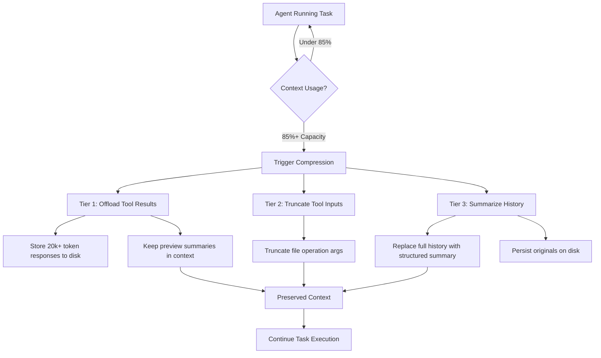

# Context Management for Deep Agents

**Source:** https://www.blog.langchain.com/context-management-for-deepagents/
**Author:** Chester Curme and Mason Daugherty
**Published:** 2026-01-28

---

## TLDR

As AI agents tackle increasingly complex, long-running tasks that exceed model context windows, effective context management through tiered compression techniques becomes essential to prevent context rot while preserving task-critical information.

---

## Key Takeaways

- Large tool responses (20,000+ tokens) should be offloaded to filesystem storage with preview summaries
- Compression should trigger at around 85% context capacity to prevent degradation
- Structured summaries can replace full conversation history while originals persist on disk
- Establish benchmarks before stress-testing compression features to validate information recoverability
- Monitor for goal drift after compression and experiment with adding "session intent" and "next steps" fields to improve performance

---

## Summary

The Deep Agents SDK addresses a critical challenge in AI agent development: managing context effectively as agents tackle increasingly complex, long-running tasks that exceed model context windows. Traditional approaches struggle with oversized tool responses and accumulated conversation history, leading to context degradation that hampers agent performance.

The SDK implements a three-tiered compression architecture to solve this problem. First, tool responses exceeding 20,000 tokens are offloaded to filesystem storage with preview summaries retained in context. Second, file operation arguments are truncated when context reaches 85% capacity. Third, structured summaries replace full conversation history while original content persists on disk for recovery if needed.

The system uses "model profiles" to determine context thresholds, triggering compression steps at specific fractions of available window capacity. Testing has revealed that compression benefits can be observed when artificially triggered at 10-20% capacity, and performance improvements have been demonstrated through prompt modifications that add "session intent" and "next steps" fields to maintain agent focus.

For practitioners implementing similar systems, the authors recommend establishing benchmarks before stress-testing individual features, validating information recoverability through targeted evaluations, monitoring for goal drift post-compression, and experimenting with the open-source Deep Agents SDK on representative use cases.

---

## Diagram

### Diagram Explanation

This flowchart illustrates the three-tiered context compression architecture used by the Deep Agents SDK. Starting from a running agent, the diagram shows how context usage is monitored, and when it reaches 85% capacity, the three compression mechanisms (offloading tool results, truncating inputs, and summarizing history) work together to preserve critical information while reducing context size.
