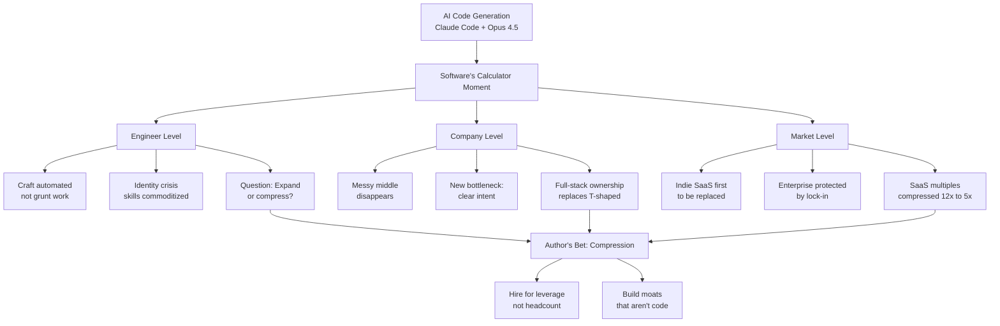

# Software's Calculator Moment

**Source:** https://eggert.substack.com/p/softwares-calculator-moment
**Author:** Lars Eggert
**Published:** 2026-01-28

---

## TLDR

AI code generation (especially Claude Code with Opus 4.5) is software engineering's "calculator moment" — automating the mechanical craft of writing code while leaving conceptual work like architecture and judgment, causing compression at engineer, company, and market levels.

---

## Key Takeaways

- **The craft is being automated, not the grunt work.** Engineers are discovering that automation eats the part they loved (writing code), leaving the "boring" work (scoping, testing, reviewing).
- **Companies are restructuring around leverage, not headcount.** The "messy middle" between idea and shipping is disappearing; the new bottleneck is forming clear intent (what to build).
- **Full-stack ownership is replacing T-shaped specialization.** Codegen collapses stack complexity, enabling end-to-end ownership across product, design, and engineering.
- **Indie SaaS is the canary; enterprise still has runway.** Narrow-focus tools are getting replaced by vibe-coded alternatives, while enterprise software is protected by integration depth and switching costs.
- **Markets are pricing in compression.** Public SaaS multiples compressed from 12x to 5x; investors now discriminate between real AI tailwinds and bolted-on narratives.

---

## Summary

The article draws a parallel between how calculators transformed mathematics and how AI code generation is transforming software engineering. Just as calculators separated computation from mathematical theory, AI is separating code writing from software architecture. In five years, we've gone from AI-assisted to AI-written code, with Claude Code and Opus 4.5 representing an inflection point.

For individual engineers, this creates an identity crisis. The skill they spent years building is being commoditized. While some business-minded engineers may thrive when "knowing what to build" matters most, many genuinely loved the craft of writing code. The article questions whether software will expand into new subspecialties (as math did with computer science) or compress inward.

At the company level, the "disappearing messy middle" is reshaping teams. Conventional structures between product, design, and engineering are dissolving. Wix merged all engineering titles into "xEngineer." Experimentation velocity has increased dramatically, with teams building 20 versions of an idea before committing. But faster velocity also means competitors move faster, creating a new failure mode: "PMF collapse" where companies must find product-market fit every three months.

Markets have noticed. iOS app releases grew 60% YoY by December 2025. Public SaaS multiples compressed while companies with AI-native business models (like Palantir at 65x sales) vastly outperform those bolting AI onto existing products. The author's bet is compression: "Hire for leverage, not headcount. Build moats that aren't code." But he acknowledges uncertainty, noting that mathematicians in 1936 couldn't have predicted how automation would expand their field.

---

## Diagram

### Diagram Explanation

This flowchart shows how AI code generation triggers a "calculator moment" that ripples through three levels: engineers (facing skill commoditization), companies (restructuring around intent rather than execution), and markets (repricing SaaS). All three converge on the author's central thesis: compression is coming, so build leverage and non-code moats.
