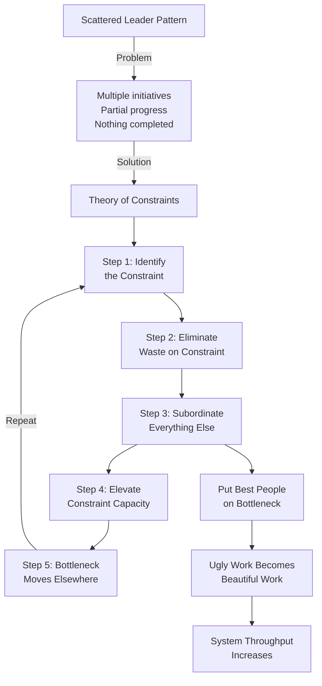

# One bottleneck at a time

**Source:** https://theengineeringmanager.substack.com/p/one-bottleneck-at-a-time
**Author:** The Engineering Manager
**Published:** 2026-01

---

## TLDR

Most leaders spread effort across multiple initiatives making partial progress on everything, but systems only improve by identifying and fixing the single biggest bottleneck at any time—everything else is wasted effort.

---

## Key Takeaways

- Every system has exactly one primary constraint limiting throughput at any given time; improving anything else doesn't improve the system
- The "scattered leader" pattern of working on multiple problems simultaneously feels productive but achieves nothing
- Put your best people on the bottleneck, even if it's unglamorous work—they'll turn ugly problems into beautiful solutions
- Subordination means slowing down or redirecting fast parts of the system to help the bottleneck
- After fixing one bottleneck, the constraint moves elsewhere—this is the signal that it worked

---

## Summary

The article introduces the concept from Eliyahu Goldratt's "The Goal" and Theory of Constraints: every system (factory, software team, organization) has exactly one constraint limiting its throughput at any given time. Leaders often fall into the "scattered leader" pattern, working on multiple problems simultaneously—slow deployments, stalled hiring, backed-up code reviews—making partial progress on everything but completing nothing. This approach optimizes for busyness rather than impact, which is particularly dangerous in today's flattened organizations where middle managers are under high scrutiny.

The alternative requires radical focus: find the single biggest bottleneck, put all effort into removing it, then find the next one. Goldratt outlines five focusing steps: identify the constraint, ensure it's not wasted on unnecessary work, subordinate everything else to it, elevate it if needed, and repeat. The key insight is that improving anything other than the constraint just creates inventory—work piling up waiting at the bottleneck.

A practical example illustrates this: if deployments are the bottleneck (only happening once every two weeks due to manual checks and fear of incidents), take your best engineers off exciting feature work and point them at fixing the deployment pipeline. This feels counterintuitive because we want high performers on sexy problems, not ugly ones. But high performers bring their standards to the work—they automate checks, improve test coverage, parallelize tests, and make deploys boring. Within weeks, deploys happen multiple times daily instead of fortnightly.

Subordination—the critical third step—means reallocating everything else to support the bottleneck. If developers produce more code than reviewers can handle, some developers should stop writing code and start reviewing, or build tooling to make reviews faster. This takes courage because it looks wrong to company leadership who question why your best engineer isn't shipping features or why velocity appears down. The alternative—busy hands creating more inventory that piles up—feels productive but achieves nothing. The discipline is simple but hard to maintain: one bottleneck at a time.

---

## Diagram

### Diagram Explanation

This flowchart visualizes the Theory of Constraints cycle, showing how the scattered leader pattern (working on many things) leads to the solution: a systematic five-step process for identifying and eliminating bottlenecks one at a time, with the cycle repeating as each constraint is resolved.
