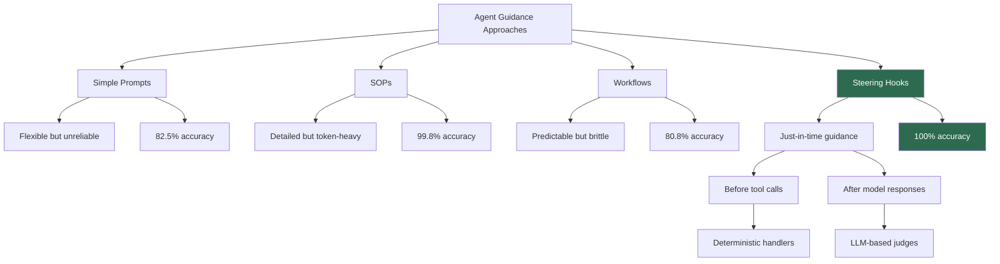

# How Steering Hooks Achieved 100% Agent Accuracy Where Prompts and Workflows Failed

**Source:** https://strandsagents.com/blog/steering-accuracy-beats-prompts-workflows/
**Author:** Clare Liguori
**Published:** 2026-03-18

---

## TLDR

Steering hooks in the Strands Agents SDK deliver just-in-time guidance to AI agents at critical decision points, achieving 100% accuracy in evaluations where prompt engineering (82.5%), SOPs (99.8%), and rigid workflows (80.8%) all fell short — without excessive token overhead.

---

## Key Takeaways

- **The "prompting treadmill" is real**: Continuously adding rules to system prompts becomes unwieldy and unpredictable at scale
- **Just-in-time beats upfront**: Steering hooks intercept agent decisions before tool calls and after model responses, delivering targeted corrections only when needed
- **100% accuracy with moderate token cost**: Steering used ~3,346 input tokens vs SOPs' ~9,879, while achieving perfect pass rates across all test scenarios
- **Workflows are brittle for open-ended tasks**: Rigid workflow graphs failed catastrophically (98% failure) on out-of-scope queries
- **Combine approaches for defense-in-depth**: Steering works alongside prompts, SOPs, and policy engines for maximum robustness

---

## Summary

The article examines why traditional approaches to guiding AI agent behavior — prompt engineering, standard operating procedures (SOPs), and workflow graphs — each have significant limitations. Simple prompts are flexible but unreliable, especially under adversarial conditions. SOPs provide detailed procedural guidance but consume significant tokens. Workflows offer predictability but sacrifice flexibility, failing badly on unexpected inputs.

Steering hooks, a feature of the Strands Agents SDK, offer a middle ground. These handlers intercept agent execution at two key points: before tool calls and after model responses. They can be deterministic Python functions (easily testable) or LLM-based judges (for nuanced evaluation), providing targeted behavioral corrections exactly when needed.

In a rigorous evaluation using a library book renewal agent across 600 runs (100 per scenario), steering achieved a perfect 100% pass rate across all six test scenarios including happy path, edge cases, and adversarial inputs. Simple instructions struggled most with mismatched card numbers (57%) and adversarial tone (64%), while workflows failed catastrophically on informational queries outside their defined flow.

The author recommends starting with simple instructions for prototyping, adopting SOPs for complex procedures, deploying steering when maximum reliability is critical, and using workflows only for linear processes — ideally combining multiple approaches for robustness.

---

## Diagram

### Diagram Explanation

The diagram compares four approaches to guiding AI agent behavior, showing their trade-offs and accuracy rates. Steering hooks stand out (highlighted in green) as the most accurate approach, with its just-in-time interception points — before tool calls and after model responses — enabling both deterministic and LLM-based corrections.
